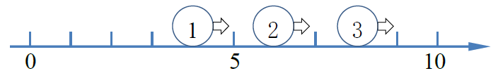
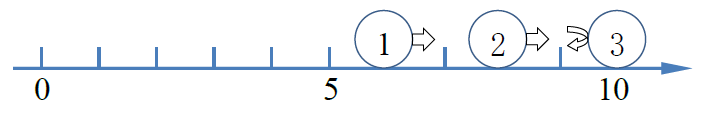
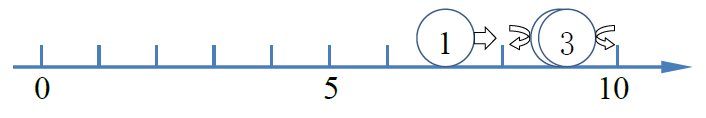
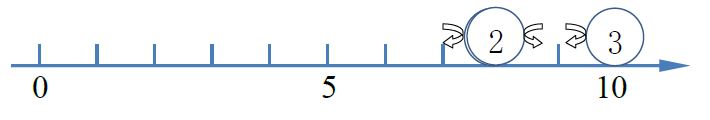
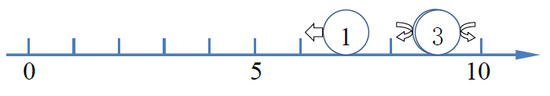

# 2018-NUAA-Data-Structrue-Experiments-design
## 2018 数据结构八次上机实验和课程设计
### 八次上机实验（2018年版）：
《数据结构》上机实验题目

（共8次，每次上机4小时）

第一阶段（线性部分）

《数据结构》第1上机题 （线性表练习）

1．编程实现书P19  ADT List 基本操作12个：

（1）用顺序存储结构实现； （2）用链式存储结构实现；

2．设元素值为整型的线性表L，分别采用顺序结构和链式结构存储，编写程序，实现线性表的就地逆置（习题集P18  2.21， 2.22）。

3．输入正整数n、m（m\&lt;n），设有n个人坐成一圈，从第1个人开始循环报数，报到m的人出列，然后再从下一个人开始报数，报到m的人又出列，如此重复，直到所有的人都出列为止。要求用链式结构和顺序结构实现，按出列的先后顺序输出每个人的信息。

4.CSP题目 学生排队

问题描述

　　体育老师小明要将自己班上的学生按顺序排队。他首先让学生按学号从小到大的顺序排成一排，学号小的排在前面，然后进行多次调整。一次调整小明可能让一位同学出队，向前或者向后移动一段距离后再插入队列。

　　例如，下面给出了一组移动的例子，例子中学生的人数为8人。

　　0）初始队列中学生的学号依次为1, 2, 3, 4, 5, 6, 7, 8；

　　1）第一次调整，命令为&quot;3号同学向后移动2&quot;，表示3号同学出队，向后移动2名同学的距离，再插入到队列中，新队列中学生的学号依次为1, 2, 4, 5, 3, 6, 7, 8；

　　2）第二次调整，命令为&quot;8号同学向前移动3&quot;，表示8号同学出队，向前移动3名同学的距离，再插入到队列中，新队列中学生的学号依次为1, 2, 4, 5, 8, 3, 6, 7；

　　3）第三次调整，命令为&quot;3号同学向前移动2&quot;，表示3号同学出队，向前移动2名同学的距离，再插入到队列中，新队列中学生的学号依次为1, 2, 4, 3, 5, 8, 6, 7。

　　小明记录了所有调整的过程，请问，最终从前向后所有学生的学号依次是多少？

　　请特别注意，上述移动过程中所涉及的号码指的是学号，而不是在队伍中的位置。在向后移动时，移动的距离不超过对应同学后面的人数，如果向后移动的距离正好等于对应同学后面的人数则该同学会移动到队列的最后面。在向前移动时，移动的距离不超过对应同学前面的人数，如果向前移动的距离正好等于对应同学前面的人数则该同学会移动到队列的最前面。

输入格式

　　输入的第一行包含一个整数n，表示学生的数量，学生的学号由1到n编号。

　　第二行包含一个整数m，表示调整的次数。

　　接下来m行，每行两个整数p, q，如果q为正，表示学号为p的同学向后移动q，如果q为负，表示学号为p的同学向前移动-q。

输出格式

　　输出一行，包含n个整数，相邻两个整数之间由一个空格分隔，表示最终从前向后所有学生的学号。

样例输入

8

3

3 2

8 -3

3 -2

样例输出

1 2 4 3 5 8 6 7

问题分析：这个问题可以通过顺序结构或（双向或单向）链表实现，但对于移动元素较多的情况，应采用哪种存储结构更优呢？

选做题：习题集 1.19 1.20 2.19

《数据结构》第2上机题 （线性表练习）

1、设元素值为整型的线性表L，分别采用顺序结构和链式结构存储，编写程序，用插入排序算法实现线性表的表排序。

2．设元素值为整型的线性表A,、B，分别采用顺序结构和链式结构存储，编写程序，实现下列功能：假设以递增有序排列的线性表A和B 分别表示两个集合，现要求在A的空间上构成一个新线性表C，其元素为A和B元素的交集，且表C中的元素也是依值递增有序排列。

3．CSP题目

**问题描述**** ：**先输入一个十进制整数n，再输入n个正整数，求它们相邻数之差可知是否为上升或下降，由上升转下降或由下降转上升为折点，求折点数。

**问题分析**** ：**如果一个点的值比左右两个都大或都小，则为折点。

样例输入：

5

1 3 5 2 1

For(int i=1;i\&lt;n-1;i++)

{

If((a[i-1]\&lt;a[i]&amp;&amp;a[i]\&gt;a[i+1])||(a[i-1]\&gt;a[i]&amp;&amp;a[i]\&lt;a[i+1]))

A++;

}

样例输出

1

样例输入：

6

3 5 1 7 8 4

样例输出

3

4．CSP题目

**问题描述**** ：**首先输入正整数n，接着输入n个正整数，如果其中存在一个数，比该数大的个数等于比该数小的个数，则输出该数，如果不存在则输出-1。

**问题分析**** ：**这个问题可以用排序来实现。

样例输入：

6

9 7 257 8

样例输出

7

样例输入：

5

9 5 257

样例输出

-1

选做题：习题集 2.24 2.29 2.30

《数据结构》 第3次上机题（线性表复习，栈与队列练习）

1．编程实现书P45   ADT Stack 基本操作9个，用顺序存储结构实现；

2．编程实现书P59   ADT Queue 基本操作9个，用链式存储结构实现；

3、 利用栈操作实现八皇后问题求解。

4.、CSP题目

问题描述

　　在某图形操作系统中,有 N 个窗口,每个窗口都是一个两边与坐标轴分别平行的矩形区域。窗口的边界上的点也属于该窗口。窗口之间有层次的区别,在多于一个窗口重叠的区域里,只会显示位于顶层的窗口里的内容。
　　当你点击屏幕上一个点的时候,你就选择了处于被点击位置的最顶层窗口,并且这个窗口就会被移到所有窗口的最顶层,而剩余的窗口的层次顺序不变。如果你点击的位置不属于任何窗口,则系统会忽略你这次点击。
　　现在我们希望你写一个程序模拟点击窗口的过程。

输入格式

输入的第一行有两个正整数,即 N 和 M。(1 ≤ N ≤ 10,1 ≤ M ≤ 10)
　　接下来 N 行按照从最下层到最顶层的顺序给出 N 个窗口的位置。 每行包含四个非负整数 x1, y1, x2, y2,表示该窗口的一对顶点坐标分别为 (x1, y1) 和 (x2, y2)。保证 x1 \&lt; x2, y1 \&lt; y2。
　　接下来 M 行每行包含两个非负整数 x, y,表示一次鼠标点击的坐标。
　　题目中涉及到的所有点和矩形的顶点的 x, y 坐标分别不超过 2559 和　　1439。

**问题分析**** ：**这个问题可以用链式线性表来实现。

输出格式：输出包括 M 行,每一行表示一次鼠标点击的结果。如果该次鼠标点击选择了一个窗口,则输出这个窗口的编号(窗口按照输入中的顺序从 1 编号到 N);如果没有,则输出&quot;IGNORED&quot;(不含双引号)。

样例输入

3 4
0 0 4 4
1 1 5 5
2 2 6 6
1 1
0 0
4 4
0 5

样例输出

2
1
1
IGNORED

样例说明

　　第一次点击的位置同时属于第 1 和第 2 个窗口,但是由于第 2 个窗口在上面,它被选择并且被置于顶层。
　　第二次点击的位置只属于第 1 个窗口,因此该次点击选择了此窗口并将其置于顶层。现在的三个窗口的层次关系与初始状态恰好相反了。
　　第三次点击的位置同时属于三个窗口的范围,但是由于现在第 1 个窗口处于顶层,它被选择。
　　最后点击的 (0, 5) 不属于任何窗口。

选做题：习题集 2.32 2.37 2.38

《数据结构》 第4次上机题（线性结构练习）

1．输入稀疏矩阵，建立稀疏矩阵三元组顺序结构，实现转置（1、2）；

2. CSP题目

问题描述：首先输入正整数n（n\&lt;10000），接着输入n个正整数（最大值为10000），对于这n个数，统计输出其中的相邻数对（差值为1的数对），相同数据只被统计一次。

**问题分析**：这个看似是一个ｎ个数与n个数进行比较（O(n^2)）的问题,能否用高效的方法解决？

样例输入

6
1 3 8 2 5 2

样例输出

2
样例输入

5
4 3 6 3 5 2

样例输出

4
3. CSP题目

问题描述：请实现一个铁路购票系统的简单座位分配算法，来处理一节车厢的座位分配。
　　假设一节车厢有20排、每一排5个座位。为方便起见，我们用1到100来给所有的座位编号，第一排是1到5号，第二排是6到10号，依次类推，第20排是96到100号。
　　购票时，一个人可能购一张或多张票，最多不超过5张。如果这几张票可以安排在同一排编号相邻的座位，则应该安排在编号最小的相邻座位。否则应该安排在编号最小的几个空座位中（不考虑是否相邻）。
　　假设初始时车票全部未被购买，现在给了一些购票指令，请你处理这些指令。

输入格式：对于所有评测用例，1 ≤ n ≤ 100，所有购票数量之和不超过100。

　　输入的第一行包含一个整数n，表示购票指令的数量。
　　第二行包含n个整数，每个整数p在1到5之间，表示要购入的票数，相邻的两个数之间使用一个空格分隔。

输出格式

输出n行，每行对应一条指令的处理结果。
　　对于购票指令p，输出p张车票的编号，按从小到大排序。

**问题分析** ：这个问题可以用顺序结构或链式结构实现。

样例输入

4
2 5 4 2

样例输出

1 2
6 7 8 9 10
11 12 13 14
3 4

选做题：习题集 3.20 3.28 3.32

第一阶段总结

**第二阶段（树与图部分）**

《数据结构》 第5次上机题目  (二叉树练习 )

1、编程实现书P121  ADT BinaryTree 基本操作20个，用二叉链表结构实现；

2.实现二叉树的先序、中序、后序遍历，用递归和非递归方法；实现层次遍历。

3、编程实现，对二叉树中每个元素值为x的结点，删除以它为根的子树，并释放相应空间。

4． CSP题目 消除类游戏

问题描述

　　消除类游戏是深受大众欢迎的一种游戏，游戏在一个包含有n行m列的游戏棋盘上进行，棋盘的每一行每一列的方格上放着一个有颜色的棋子，当一行或一列上有连续三个或更多的相同颜色的棋子时，这些棋子都被消除。当有多处可以被消除时，这些地方的棋子将同时被消除。

　　现在给你一个n行m列的棋盘，棋盘中的每一个方格上有一个棋子，请给出经过一次消除后的棋盘。

　　请注意：一个棋子可能在某一行和某一列同时被消除。

输入格式

　　输入第一行包含两个整数n, m，用空格分隔，分别表示棋盘的行数和列数。

　　接下来n行，每行m个整数，用空格分隔，分别表示每一个方格中的棋子的颜色。颜色使用1至9编号。

输出格式

　　输出n行，每行m个整数，相邻的整数之间使用一个空格分隔，表示经过一次消除后的棋盘。如果一个方格中的棋子被消除，则对应的方格输出0，否则输出棋子的颜色编号。

样例输入

4 5

2 2 3 1 2

3 4 5 1 4

2 3 2 1 3

2 2 2 4 4

样例输出

2 2 3 0 2

3 4 5 0 4

2 3 2 0 3

0 0 0 4 4

样例说明

　　棋盘中第4列的1和第4行的2可以被消除，其他的方格中的棋子均保留。

样例输入

4 5

2 2 3 1 2

3 1 1 1 1

2 3 2 1 3

2 2 3 3 3

样例输出

2 2 3 0 2

3 0 0 0 0

2 3 2 0 3

2 2 0 0 0

样例说明

　　棋盘中所有的1以及最后一行的3可以被同时消除，其他的方格中的棋子均保留。

问题分析：这个问题与树无关，可以使用二维数组来存储，通过一遍遍历对符合条件的格子进行标记，然后第二遍遍历时消除符合条件的格子。

选做题：习题集 6.42 6.45 6.47

《数据结构》 第6次上机题目  ( 二叉树、树、图练习 )

1．编程实现书P156  ADT Graph 基本操作13个，用邻接矩阵存储结构实现；

2、输入N个权值（1-100正整数），建立哈夫曼树。

3、编程实现，对一棵以孩子-兄弟链表表示的树，求树的高度。

4、CSP题目 碰撞的小球

问题描述

　　数轴上有一条长度为L（L为偶数)的线段，左端点在原点，右端点在坐标L处。有n个不计体积的小球在线段上，开始时所有的小球都处在偶数坐标上，速度方向向右，速度大小为1单位长度每秒。

　　当小球到达线段的端点（左端点或右端点）的时候，会立即向相反的方向移动，速度大小仍然为原来大小。

　　当两个小球撞到一起的时候，两个小球会分别向与自己原来移动的方向相反的方向，以原来的速度大小继续移动。

　　现在，告诉你线段的长度L，小球数量n，以及n个小球的初始位置，请你计算t秒之后，各个小球的位置。

提示

　　因为所有小球的初始位置都为偶数，而且线段的长度为偶数，可以证明，不会有三个小球同时相撞，小球到达线段端点以及小球之间的碰撞时刻均为整数。

　　同时也可以证明两个小球发生碰撞的位置一定是整数（但不一定是偶数）。

输入格式

　　输入的第一行包含三个整数n, L, t，用空格分隔，分别表示小球的个数、线段长度和你需要计算t秒之后小球的位置。

　　第二行包含n个整数a1, a2, …, an，用空格分隔，表示初始时刻n个小球的位置。

输出格式

　　输出一行包含n个整数，用空格分隔，第i个整数代表初始时刻位于ai的小球，在t秒之后的位置。

样例输入

3 10 5

4 6 8

样例输出

7 9 9

样例说明

初始时，三个小球的位置分别为4, 6, 8。

一秒后，三个小球的位置分别为5, 7, 9。

 
两秒后，第三个小球碰到墙壁，速度反向，三个小球位置分别为6, 8, 10。

　　三秒后，第二个小球与第三个小球在位置9发生碰撞，速度反向（注意碰撞位置不一定为偶数），三个小球位置分别为7, 9, 9。

四秒后，第一个小球与第二个小球在位置8发生碰撞，速度反向，第三个小球碰到墙壁，速度反向，三个小球位置分别为8, 8, 10。

五秒后，三个小球的位置分别为7, 9, 9。
样例输入

10 22 30

14 12 16 6 10 2 8 20 18 4

样例输出

6 6 8 2 4 0 4 12 10 2

问题分析：该问题中，只需维护好每个小球的当前位置，并随时间进行变化，最后按题设要求进行输出即可，本题目实质是一道简单的模拟题，与树、图无关。

选做题：习题集 6.49 6.60 6.62

《数据结构》 第7次上机题目  ( 图 练习 )

1、图的深度优先和广度优先遍历；

2、编写拓扑排序算法；

3、CSP题目

问题描述：小刘承包了很多片麦田，为了灌溉这些麦田，小刘在第一个麦田挖了一口很深的水井，所有的麦田都从这口井来引水灌溉。 为了灌溉，小刘需要建立一些水渠，以连接水井和麦田，小刘也可以利用部分麦田作为&quot;中转站&quot;，利用水渠连接不同的麦田，这样只要一片麦田能被灌溉，则与其连接的麦田也能被灌溉。现在小刘知道哪些麦田之间可以建设水渠和建设每个水渠所需要的费用（注意不是所有麦田之间都可以建立水渠）。请问灌溉所有麦田最少需要多少费用来修建水渠。

输入格式：输入的第一行包含两个正整数n, m，分别表示麦田的片数和小刘可以建立的水渠的数量。麦田使用1, 2, 3, ……依次标号。    接下来m行，每行包含三个整数ai, bi, ci，表示第ai片麦田与第bi片麦田之间可以建立一条水渠，所需要的费用为ci。

输出格式：输出一个整数，表示灌溉所有麦田所需要的最小费用，及水渠连接说明。

**问题分析**：这个问题可以用最小生成树算法实现。

输入样例:

4 4

1 2 1

2 3 4

2 4 2

3 4 3

输出样例:

6

建立以下3条水渠：麦田1与麦田2、麦田2与麦田4、麦田4与麦田3。

选做题：习题集 7.27 7.34 7.37

第二阶段总结

第三阶段（查找与排序部分）

《数据结构》 第8次上机题目  ( 查找 排序 练习 )

1、实现二叉排序树的插入和删除。

2．实现交换、选择、归并等简单排序算法；

3．实现快速排序算法；

4．实现堆排序算法；

5．CSP题目数字排序

问题描述

　　给定n个整数，请统计出每个整数出现的次数，按出现次数从多到少的顺序输出。

输入格式

　　输入的第一行包含一个整数n，表示给定数字的个数。

　　第二行包含n个整数，相邻的整数之间用一个空格分隔，表示所给定的整数。

输出格式

输出多行，每行包含两个整数，分别表示一个给定的整数和它出现的次数。按出现次数递减的顺序输出。如果两个整数出现的次数一样多，则先输出值较小的，然后输出值较大的。

样例输入

12

5 2 3 3 1 3 4 2 5 2 3 5

样例输出

3 4

2 3

5 3

1 1

4 1

问题分析：该题目可用一个数组，以下标作为数，数组内容存储该数出现次数来实现（这就相当于直接映射，是机试题目里面常用的一种解题法，很多看似非线性的题型最后其实都可以采取哈希或者映射的方法来巧解，尤其是一些看似是树形结构的模拟类题目，要好好体会哈希思想在机试题目中的巧用）。

选做题：习题集 9.32 10.32 10.34
### 课程设计题目（2018年版）：
（1-6题必做）

1、购物网站信息管理（必做）（线性表）

**[问题描述]**

设计一个程序，对商铺信息管理，商铺信息包括：商铺编号，商铺名，信誉度（0-5），（商品名称1，价格1，销量1），（商品名称2，价格2，销量2），（商品名称3，价格3，销量3）…。

商品名称包括(毛巾，牙刷，牙膏，肥皂，洗发水，沐浴露等6种以上商品)，每个商铺具有其中事先确定若干商品及价格，由文件输入，销量初始为0。

**[基本要求]**

**（1）建立一个单向链表存储所有** 商铺信息（至少30个） **，以编号为序，编号从1开始递增，从文件中读取数据，并能将数据存储在文件。** 商铺信息结点的数据结构自行设计。

（2） **可以增、删商铺。增加商铺，编号自动加一，插入链表尾部；删除商铺，以编号为准，并修改后续结点的编号，保持编号连续性。可增、删商品。**

（3）查询某一种商品名称，建立一个双向循环链表，结点信息是包含该商品的所有商铺编号、商铺名、信誉度、商品名称、价格、销量，以信誉度从高至低，并按销量排序，并逐一显示。

（4）购买某一商铺的商品，修改 **单向链表中商品的信息的销量** 。

（5）建立一个顺序结构，按商品名Hash分配地址，存储当前每种商品总销量并输出。

（6）任何的商铺信息变化，实现文件存储。

2、公共钥匙盒（必做）（线性表，栈，队列）

[问题描述]

　　有一个学校的老师共用N个教室，按照规定，所有的钥匙都必须放在公共钥匙盒里，老师不能带钥匙回家。每次老师上课前，都从公共钥匙盒里找到自己上课的教室的钥匙去开门，上完课后，再将钥匙放回到钥匙盒中。

　　钥匙盒一共有N个挂钩，从左到右排成一排，用来挂N个教室的钥匙。一串钥匙没有固定的悬挂位置，但钥匙上有标识，所以老师们不会弄混钥匙。

　　每次取钥匙的时候，老师们都会找到自己所需要的钥匙将其取走，而不会移动其他钥匙。每次还钥匙的时候，还钥匙的老师会找到最左边的空的挂钩，将钥匙挂在这个挂钩上。如果有多位老师还钥匙，则他们按钥匙编号从小到大的顺序还。如果同一时刻既有老师还钥匙又有老师取钥匙，则老师们会先将钥匙全还回去再取出。

　　今天开始的时候钥匙是按编号从小到大的顺序放在钥匙盒里的。有K位老师要上课，给出每位老师所需要的钥匙、开始上课的时间和上课的时长，假设下课时间就是还钥匙时间，请问最终钥匙盒里面钥匙的顺序是怎样的？

[基本要求]

输入格式

　　输入的第一行包含两个整数N, K。

　　接下来K行，每行三个整数w, s, c，分别表示一位老师要使用的钥匙编号、开始上课的时间和上课的时长。可能有多位老师使用同一把钥匙，但是老师使用钥匙的时间不会重叠。

　　保证输入数据满足输入格式，你不用检查数据合法性。

输出格式

　　输出一行，包含N个整数，相邻整数间用一个空格分隔，依次表示每个挂钩上挂的钥匙编号。

样例输入

5 2

4 3 3

2 2 7

样例输出

1 4 3 2 5

样例说明

　　第一位老师从时刻3开始使用4号教室的钥匙，使用3单位时间，所以在时刻6还钥匙。第二位老师从时刻2开始使用钥匙，使用7单位时间，所以在时刻9还钥匙。

　　每个关键时刻后的钥匙状态如下（X表示空）：

　　时刻2后为1X345；

　　时刻3后为1X3X5；

　　时刻6后为143X5；

　　时刻9后为14325。

课程设计要求：

（1）要求从文本文件中输入；

（2）根据时间进程，将取走钥匙和归还钥匙分别视为事件，放入队列中，然后通过每个事件的先后发生对钥匙盒的状态进行变更；

（3）严格按照要求的输入输出格式进行数据的输入、输出（训练CSP考试中的格式化输入输出的正确性）；

（4）选做：通过图形界面来显示钥匙盒的即时状态，以及事件队列的状态。

3、树的应用 (必做)（树）

 [问题描述]

　　JSON (JavaScript Object Notation) 是一种轻量级的数据交换格式，可以用来描述半结构化的数据。JSON 格式中的基本单元是值 (value)，出于简化的目的本题只涉及 2 种类型的值：

　　\* 字符串 (string)：字符串是由双引号 &quot; 括起来的一组字符（可以为空）。如果字符串的内容中出现双引号 &quot;，在双引号前面加反斜杠，也就是用 \&quot; 表示；如果出现反斜杠 \，则用两个反斜杠 \\ 表示。反斜杠后面不能出现 &quot; 和 \ 以外的字符。例如：&quot;&quot;、&quot;hello&quot;、&quot;\&quot;\\&quot;。

　　\* 对象 (object)：对象是一组键值对的无序集合（可以为空）。键值对表示对象的属性，键是属性名，值是属性的内容。对象以左花括号 { 开始，右花括号 } 结束，键值对之间以逗号 , 分隔。一个键值对的键和值之间以冒号 : 分隔。键必须是字符串，同一个对象所有键值对的键必须两两都不相同；值可以是字符串，也可以是另一个对象。例如：{}、{&quot;foo&quot;: &quot;bar&quot;}、{&quot;Mon&quot;: &quot;weekday&quot;, &quot;Tue&quot;: &quot;weekday&quot;, &quot;Sun&quot;: &quot;weekend&quot;}。

　　除了字符串内部的位置，其他位置都可以插入一个或多个空格使得 JSON 的呈现更加美观，也可以在一些地方换行，不会影响所表示的数据内容。例如，上面举例的最后一个 JSON 数据也可以写成如下形式。

　　{

　　&quot;Mon&quot;: &quot;weekday&quot;,

　　&quot;Tue&quot;: &quot;weekday&quot;,

　　&quot;Sun&quot;: &quot;weekend&quot;

　　}

　　给出一个 JSON 格式描述的数据，以及若干查询，编程返回这些查询的结果。

输入格式

　　第一行是两个正整数 n 和 m，分别表示 JSON 数据的行数和查询的个数。

　　接下来 n 行，描述一个 JSON 数据，保证输入是一个合法的 JSON 对象。

　　接下来 m 行，每行描述一个查询。给出要查询的属性名，要求返回对应属性的内容。需要支持多层查询，各层的属性名之间用小数点 . 连接。保证查询的格式都是合法的。

[基本要求]

输出格式

　　对于输入的每一个查询，按顺序输出查询结果，每个结果占一行。

　　如果查询结果是一个字符串，则输出 STRING \&lt;string\&gt;，其中 \&lt;string\&gt; 是字符串的值，中间用一个空格分隔。

　　如果查询结果是一个对象，则输出 OBJECT，不需要输出对象的内容。

　　如果查询结果不存在，则输出 NOTEXIST。

样例输入

10 5

{

&quot;firstName&quot;: &quot;John&quot;,

&quot;lastName&quot;: &quot;Smith&quot;,

&quot;address&quot;: {

&quot;streetAddress&quot;: &quot;2ndStreet&quot;,

&quot;city&quot;: &quot;NewYork&quot;,

&quot;state&quot;: &quot;NY&quot;

},

&quot;esc\\aped&quot;: &quot;\&quot;hello\&quot;&quot;

}

firstName

address

address.city

address.postal

esc\aped

样例输出

STRING John

OBJECT

STRING NewYork

NOTEXIST

STRING &quot;hello&quot;

**[基本要求]**

（1）要求从文本文件中输入；

（2）本题目其实就是一棵普通的树（即每个结点的孩子数不固定，不能单纯采用n叉树来解决），可以考虑使用孩子兄弟表示法等进行表示和存储；

（3）严格按照要求的输入输出格式进行数据的输入、输出（训练CSP考试中的格式化输入输出的正确性）；

（4）选做：使用图形界面（或字符格式化摆成的树形结构，参考Linux下的tree命令），以树状形式显示输入的JSON格式数据。

4、Huffman编码与解码(必做)（Huffman编码、二叉树）

[**问题描述**]

对一篇不少于2000字符的英文文章（source.txt），统计各字符出现的次数，实现Huffman编码(code.dat)，以及对编码结果的解码(recode.txt)。

**[基本要求]**

（1） 输出每个字符出现的次数和编码,并存储文件(Huffman.txt)。

（2） 在Huffman编码后，英文文章编码结果保存到文件中(code.dat)，编码结果必须是二进制形式，即0 1的信息用比特位表示，不能用字符&#39;0&#39;和&#39;1&#39;表示。

（3） 实现解码功能。

5、行车路线  (必做)（图）

[问题描述]

　　小明和小芳出去乡村玩，小明负责开车，小芳来导航。

　　小芳将可能的道路分为大道和小道。大道比较好走，每走1公里小明会增加1的疲劳度。小道不好走，如果连续走小道，小明的疲劳值会快速增加，连续走s公里小明会增加s2的疲劳度。

　　例如：有5个路口，1号路口到2号路口为小道，2号路口到3号路口为小道，3号路口到4号路口为大道，4号路口到5号路口为小道，相邻路口之间的距离都是2公里。如果小明从1号路口到5号路口，则总疲劳值为(2+2)2+2+22=16+2+4=22。

现在小芳拿到了地图，请帮助她规划一个开车的路线，使得按这个路线开车小明的疲劳度最小。

[基本要求]

输入格式：

　　输入的第一行包含两个整数n, m，分别表示路口的数量和道路的数量。路口由1至n编号，小明需要开车从1号路口到n号路口。

接下来m行描述道路，每行包含四个整数t, a, b, c，表示一条类型为t，连接a与b两个路口，长度为c公里的双向道路。其中t为0表示大道，t为1表示小道。保证1号路口和n号路口是连通的。

输出格式

输出一个整数，表示最优路线下小明的疲劳度。

样例输入

6 7

1 1 2 3

1 2 3 2

0 1 3 30

0 3 4 20

0 4 5 30

1 3 5 6

1 5 6 1

样例输出

76

样例说明

　　从1走小道到2，再走小道到3，疲劳度为52=25；然后从3走大道经过4到达5，疲劳度为20+30=50；最后从5走小道到6，疲劳度为1。总共为76。

课程设计要求：

（1）要求从文本文件中输入；

（2）采用适当的数据结构存储由输入数据中的道路所形成的图结构；

（3）编写尽可能优的算法，处理好连续走小道造成的疲劳值的指数增长（提示：基于迪杰斯特拉算法进行改进即可完成本题）；

（4）除严格按题目要求进行输出以外，还要求输出最优路线的路径，以及从出发点到各个点的最小疲劳值。

6、排序算法比较 （必做）（排序）

[问题描述]

利用随机函数产生10个样本，每个样本有20000个随机整数（并使第一个样本是正序，第二个样本是逆序），利用直接插入排序、希尔排序，冒泡排序、快速排序、选择排序、堆排序，归并排序、基数排序8种排序方法进行排序（结果为由小到大的顺序），并统计每一种排序算法对不同样本所耗费的时间。

** **** [基本要求]**

（1） 原始数据存在文件中，用相同样本对不同算法进行测试；

（2） 屏幕显示每种排序算法对不同样本所花的时间；

**（7-16题选做）**

7、【3】 用扑克牌计算24点（选做）（线性结构，数组）

[**问题描述**]

一副扑克牌的每张牌表示一个数（J、Q、K分别表示11、12、13，两个司令都表示6）。任取4张牌，即得到1-13的数，请添加运算符（规定为加、减、乘、除四种）使之成为运算式。每个数只能参与一次运算，4个数顺序可以任意组合，4个运算符任意取3个且可以重复取。运算遵从一定有限级别，可加括号控制，最终使运算结果为24.请输出一种解决方案的表达式，用括号表示运算优先。如果没有解决方案，则输出-1表示无解。

**[基本要求]**

（1）输入说明：在一行中给出4个整数，每个整数取值范围是[1, 13].

（2）输出说明：输出一种解决方案的表达式，用括号表示运算优先，如果没有解决方案，则输出-1。

（3）测试用例： 输入  2 3 12 12  输出 （（3-2）\*12）+12

（4）可选要求：输入采用随机生成4个整数， 输出要求输出该4个整数所有可能的解决方案。

8、【3】 朋友圈（选做）（集合的等价关系）

[**问题描述**]

某学校有N个学生，形成M个俱乐部。每个俱乐部里的学生有着相似的兴趣爱好，形成一个朋友圈。一个学生可以同时属于若干个不同的俱乐部。根据&quot;我的朋友的朋友也是我的朋友&quot;这个推论可以得出，如果A和B是朋友，且B和C是朋友，则A和C也是朋友。请编写程序计算最大朋友圈中有多少人。

**[基本要求]**

（1）输入说明：输入的第一行包含两个正整数N (N\&lt;=30 000)和M (M\&lt;=1000)，分别代表学校的学生总数和俱乐部的个数。随后的M行每行按以下格式给出一个俱乐部的信息，其中学生从1-N编号：

第i个俱乐部的人数Mi（空格）学生1（空格）学生2… 学生Mi

（2）输出说明：输出一个整数，表示在最大朋友圈中有多少人。

（3）测试用例：

输入  7 4

      3 1 2 3

      2 1 4

      3 5 6 7

      1 6

  输出  4

9、【2】 社交网络图中结点的&quot;重要性&quot;计算（选做）（图）

[**问题描述**]

在社交网络中，个人或单位（结点）之间通过某些关系（边）联系起来。他们受到这些关系的影响，这种影响可以理解为网络中相互连接的结点之间蔓延的一种相互作用，可以增强也可以减弱。而结点根据其所处的位置不同，在网络中体现的重要性也不尽相同。

&quot;紧密度中心性&quot;是用来衡量一个结点达到其他结点的&quot;快慢&quot;的指标，即一个有较高中心性的结点比有较低中心性的结点能够更快地（平均意义下）到达网络中的其他结点，因而在该网络的传播过程中有更重要的价值。在有N个结点的网络中，结点vi的&quot;紧密度中心性&quot; 

对于非连通图，所有结点的紧密度中心性都是0。

本实验给定一个无权的无向图以及其中的一组结点，要求计算这组结点中每个结点的紧密度中心性。

**[基本要求]**

（1）输入说明：输入的第一行给出两个正整数N (N\&lt;=1000)和M，其中N是图中结点个数，结点编号从1到N； M（M\&lt;=10000）是边的数目。随后的M行中，每行给出一条边的信息，即该边连接的两个结点编号，中间用空格分隔。最后一行给出需要计算紧密度中心性的这组结点的个数K（K\&lt;=100），以及K个结点的编号，用空格分隔。

（2）输出说明：按照&quot;Cc(i)=x.xx&quot;的格式输出K个给定结点的紧密度中心性，每个输出占一行，结果精确到小数点后2位。

（3）测试用例：

输入  5 8

      1 2

      1 3

      1 4

      2 3

      3 4

      4 5

      2 5

      3 5

      2 4 3

输出  Cc(4) = 0.80

      Cc(3) = 1.00

10、【3】 魔法优惠券（选做）（排序）

[**问题描述**]

在火星上有个魔法商店，通过魔法优惠券。每个优惠券上印有一个整数面值K，表示若你在购买某商品使用这张优惠券，可以得到K倍该商品价值的回报。该商店还免费赠送一些有价值的商品，但如果你在领取免费赠品的时候使用面值为正的优惠券，则必须倒贴给商品K倍该商品价值的金额……但是不要紧，还有面值为负的优惠券可以用。

例如，给定一组优惠券，面值分别为1、2、4、-1；对应一组商品，价值为火星币7、6、-2、-3，其中负的价值表示该商品是免费赠品。我们可以将优惠券3（面值4）用在商品1（价值7）上，得到火星币28的回报。优惠券4（面值-1）用在商品4（价值-3）上，得到火星币3的回报。但是，如果一不小心把优惠券3（面值4）用到商品4（价值-3）上，你必须倒贴给商店火星币12个。同样，把优惠券4（面值-1）用到商品1（价值7）上，你必须倒贴给商店火星币7个。

规定每张优惠券和每件商品都只能最多被使用一次，求你可以得到的最大回报。

**[基本要求]**

（1）输入说明：输入有两行。第一行首先给出优惠券的个数N，随后给出N个优惠券的整数面值。 第二行首先给出商品的个数M，随后给出M个商品的整数价值。N和M在[1,106]之间，所有的数据大小不超过230，数字间以空格分隔。

（2）输出说明：输出可以得到的最大回报。

（3）测试用例：

输入  4 1 2 4 -1

      4 7 6 -2 -3

输出  43

输入：4 3 2 6 1

      3 2 6 3

输出：49

输入： 7 3 36 -1 73 2 3 6

       6 -1 -1 -1 -1 -1 -1

输出： 1

11、【2】迷宫问题（选做）（栈与队列），（深度搜索，广度搜索）

[**问题描述**]

利用栈操作实现迷宫问题求解。

**[基本要求]**

（1）从文件中读取数据，生成模拟迷宫地图，不少于10行10列。

（2）给出任意入口和出口，显示输出迷宫路线。

12、【3】Hash表应用 （选做） （查找）

[问题描述]

设计散列表实现VIP客户发掘。对身份证号进行Hash, 通过对乘客某时间段内的乘机频率、里程数统计，发掘VIP客户。

[基本要求]

（1） 设每个记录有下列数据项：身份证号码（虚构，位数和编码规则与真实一致即可）、姓名、航班号、航班日期、里程。

（2） 从文件输入各记录，以身份证号码为关键字建立散列表。

（3） 分别采用开放定址（自行选择和设计定址方案）和链地址两种方案解决冲突；显示发生冲突的次数、每次中解决冲突进行重定位的次数。

（4）记录条数至少在100条以上。

（5） 从记录中实现乘客乘机频率、里程数统计，从而发掘VIP客户。

13、【4】公交线路提示  (选做) （图）

[问题描述]

上网下载真实南京公交线路图，建立南京主要公交线路图的存储结构。

**[基本要求]**

（1）输入任意两站点，给出转车次数最少的乘车路线。

（2）输入任意两站点，给出经过站点最少的乘车路线。

14、【3】营业窗口队列模拟 (选做)（队列）

[**问题描述**]

实现具有n（n=3）个窗口的现实队列模拟，统计每人的等待时间。

**[基本要求]**

（1） 随机产生顾客的到达时间和服务时间存储文件。

（2） 利用文件数据实现队列的插入和删除。

（3）当有顾客离开时，根据队列长度调整队尾。

（4）考虑顾客中途离队的情况。

（5） 考虑顾客具有优先级的情况。

15、【4】B-树应用 （选做） （查找）

[**问题描述**]

设计并实现B-树的一种应用。

**[基本要求]**

（1）从文件中读取数据

（2）实现B-树的插入、删除、查找功能。

16、【2】算术表达式求值 (选做) （栈）

**[问题描述]**

　　一个算术表达式是由操作数(operand)、运算符(operator)和界限符(delimiter)组成的。假设操作数是正实数，运算符只含加减乘除等四种运算符，界限符有左右括号和表达式起始、结束符&quot;#&quot;，如：#6+15\*（21-8/4）#。引入表达式起始、结束符是为了方便。编程利用&quot;运算符优先法&quot;求算术表达式的值。

**[基本要求]**

（1） 从键盘或文件读入一个合法的算术表达式，输出正确的结果。

（2） 显示输入序列和栈的变化过程。

（3） 考虑算法的健壮性，当表达式错误时，要给出错误原因的提示。

（4） 实现非整数的处理。

17、【4】家谱管理系统（选做） （树）

[问题描述]

实现具有下列功能的家谱管理系统。

**[基本要求]**

（1）输入文件以存放最初家谱中各成员的信息，成员的信息中均应包含以下内容：姓名、出生日期、婚否、地址、健在否、死亡日期（若其已死亡），也可附加其它信息、但不是必需的。

（2）实现数据的存盘和读盘。

（3）以图形方式显示家谱。

（4）显示第n 代所有人的信息。

（5）按照姓名查询，输出成员信息（包括其本人、父亲、孩子的信息）。

（6）按照出生日期查询成员名单。

（7）输入两人姓名，确定其关系。

（8）某成员添加孩子。

（9）删除某成员（若其还有后代，则一并删除）。

（10）修改某成员信息。

（11）要求建立至少30个成员的数据，以较为直观的方式显示结果，并提供文稿形式以便检查。

（12）界面要求：有合理的提示，每个功能可以设立菜单，根据提示，可以完成相关的功能要求。

（13）存储结构：根据系统功能要求自行设计，但是要求相关数据要存储在数据文件中。测试数据：要求使用1、全部合法数据；2、局部非法数据。进行程序测试，以保证程序的稳定。

18、【4】平衡二叉树操作的演示（选做） （查找）

[**问题描述**]

利用平衡二叉树实现一个动态查找表。

**[基本要求]**

（1）实现动态查找表的三种基本功能：查找、插入和删除。

（2）题目详情见习题册P168 6.4。

19、【3】编写&quot;连连看&quot;程序。(选做)（图）

[**问题描述**]

建立一个10\*20的矩形方格图，其中有10种不同的图案，每种图案个数为偶数，填满矩形方格图。

**[基本要求]**

（1）随机产生原始数据

（2）输入两个位置，如果两者图案相同，并且用少于等于3的直线相连，可消除该两个图案。

20、【4】电子小字典（选做）（查找）

[**问题描述**]

利用键树结构，建立一个微型电子字典。

**[基本要求]**

实现生词的加入，单词的查找、删除，修改等操作。

21、。。。。（可自选合适的题目，分值需要经过教师/助教认定）

注：选做题中标注，为该题分值。如【3】，表示分值为3。

**（根据完成情况，符合要求，提出申请，才可参评优秀）**

**成绩评定细则：**
1. 正确性、功能的完备性和总程序量：程序是否可以运行，结果是否正确，是否实现要求的所有子功能，是否达到足够     的程序代码 （50分）

   程序代码\&gt;=3000 &amp;&amp; 必做题 &amp;&amp; 选做题分值12以上  （40分-50分）

   程序代码\&gt;=2500 &amp;&amp; 必做题 &amp;&amp; 选做题分值6以上   （30分-39分）

   程序代码\&gt;=2000 &amp;&amp; 必做题 &amp;&amp; 选做题分值3以上   （20分-29分）

    程序代码\&gt;=1500 &amp;&amp; 必做题                       （10分-19分）

2. 课程设计报告中的算法说明的清晰程度，课程设计报告中总结的深刻程度（20分）
3. 独立完成情况( 30分）

总计：100分  以五分制（优、良、中、及格、不及格）对应。

加分项目：

1.健壮性：异常处理的情况

2.可读性：代码编写是否规范，是否便于阅读。如函数、变量命名，&#39;{ }&#39;的缩进，关键位置适量注释等

3.功能的完善：除要求实现的功能外，完成了其它的功能，实现了功能的完善

4.界面的设计：良好交互的界面

编程语言：C、C++ 等

检查方式:

1. 总体上检查程序的代码量，正确性，可读性，健壮性，功能的完备性,程序的结构是否合理；局部检查三个以上函数块
2. 检查程序的运行情况
3. 检查时间：每个学生的检查时间10分钟左右

时间安排：

1 上机时间安排

2 课程设计报告电子文档上交时间

3 课程设计检查时间

课程设计报告要求：

1.所有的课程设计报告，均要有封面，包括：数据结构课程设计、班级、学号、姓名、和指导教师；

2.目录；

3.对每一题，给出自己采用的数据结构；

4.给出算法设计思想；

5.给出实现的源程序，并在必要的代码处给出注释；

6.给出测试数据和结果；

7.给出算法的时间复杂度、另外可以提出算法的改进方法；

8.结束语：说明总体完成情况，每一题的程序代码行，总代码行，心得体会；